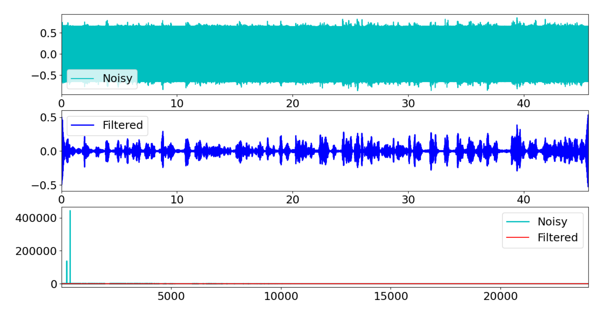

# Noise Filter

### Giriş
Projenin çalışması için program kodu ile ayıklanacak input dosyası aynı klasörde bulunmalıdır. Input dosyasının ismi programda "input.wav" olarak belirtilmiştir. Dosyanızın ismi farklı ise lütfen bu şekilde değiştiriniz. Program çalıştıktan sonra "output.wav" isimli bir dosya üretecektir ve bunu çalışılan dizine kayıt edecektir.

Sonuç olarak ise aşağıdaki grafik çıktısı elde edilebilecektir.



Üstte --> Input dosyasının zamana ekseninde görünümü
Altta --> Filtrelenmiş ve filtrelenmemiş sinyallerin frekans ekseninde, karşılaştırılması.
Ortada --> Filtrelenmiş yeni sinyalin zaman ekseninde görünümü

Gürültü analizine göre 250 ve 400Hz değerlerinde gürültü tespit edilmiş olup, bu sinyallerin filtrelemesi yapılmıştır.

### Python Code
Gerekli kütüphaneler aşağıdaki kod ile eklenir:
```python
########### Tanımlamalar ###################
############################################
from scipy.fft import rfft, irfft, rfftfreq
from scipy.io import wavfile
from matplotlib import pyplot as plt
import numpy as np

# Ekrana çizdirilecek grafik ayarları
plt.rcParams['figure.figsize'] = [16, 12]
plt.rcParams.update({'font.size': 18})

```

Ses sinyallerini tanımlayabiliriz ya da tanımlanmış halde bir dosyadan okuyabiliriz. Bu örnekte verilerimizi dosyadan okuyacağız. Bunun için gerekli kodlar şöyledir; 
```python

### Dosya girdisi ve değişken tanımları ####
############################################
fs, data = wavfile.read('./input.wav')

f = (data / 2.0**31) # Dosyanın veri kısmı
dt = 1/fs            # Örnekleme periyodu
n = f.shape[0]       # veri uzunluğu
duration = n/fs      # süre (sn)

time = np.arange(0,duration,dt)

# Girdi dosyasının zaman alanındaki çıktısı
"""plt.plot(time, f, 'b')
plt.show()"""

```

Fourier dönüşümlerin yapıldığı bölüm

```python
########### FFT Computation ################
############################################

# Ses verisinin reel kısmını tutan liste
signal = f[:,0] 

# Reel girdiler için fourier transform
data_fft = rfft(signal)
freq = rfftfreq(signal.size, d=1./fs)
L = np.arange(1,np.floor(n/2),dtype='int')

#Sinyallerin genlik değerlerinin bulunması
data_fft_abs = np.abs(data_fft)

# Genlik değerleriyle frekans alanında çıktımız oluşturulur
"""plt.plot(freq, data_fft_abs)
plt.xlabel("frequency, Hz")
plt.ylabel("Amplitude, units")
plt.show()"""
```

Sinyalin filtrelendiği bölüm

```python
# Genlik değeri 200'ün üzerinde olan frekanslar listelenir
"""for i,f in enumerate(data_fft_abs):
    if f>200:  
        print('frequency = {} Hz with amplitude {} '.format(np.round(freq[i],1),  np.round(f)))"""

# 250Hz ve 400Hz değerleri için filtre
for i,f in enumerate(freq):
    if (f < 251 and f > 249):
        data_fft[i] = 0.0
    if (f < 401 and f > 399):
        data_fft[i] = 0.0
```

Çıktı ve Grafik işlemleri

```python

########## Plot ve dosya işlemleri #############
################################################

# Son halini alan verimizin ters fourier dönüşümü yapılır
output = irfft(data_fft)

# verimiz "output.wav" adıyla proje dizinine kaydedilir 
wavfile.write("output.wav", fs, output)

# Plot işlemleri
fig,axs = plt.subplots(3,1)
plt.sca(axs[0])
plt.plot(time, signal, 'c', LineWidth = 1.5, label = 'Noisy')
plt.xlim(time[0],time[-1])
plt.legend()

plt.sca(axs[1])
plt.plot(time, output, 'b', LineWidth = 2, label = 'Filtered')
plt.xlim(time[0],time[-1])
plt.legend()

plt.sca(axs[2])
plt.plot(freq[L],data_fft_abs[L], 'c', LineWidth = 2, label = 'Noisy')
plt.plot(freq[L],output[L],'r', LineWidth = 1.5, label = 'Filtered')
plt.xlim(freq[L[0]],freq[L[-1]])
plt.legend() 

plt.show()

```
Learn Data Science & Python here!
https://www.patika.dev
